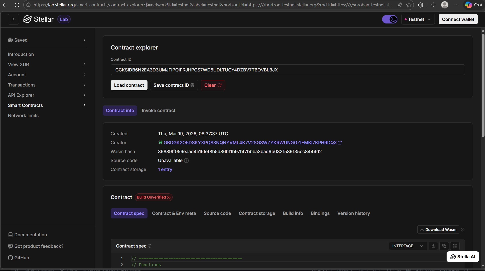

# Grant Distribution System

A Soroban smart contract workspace for decentralized grant management on Stellar.



A Soroban smart contract workspace Frontend for decentralized grant management on Stellar.


## Overview

This project implements a grant lifecycle on-chain:

- Create a grant with an ID and amount
- Apply to an existing grant
- Approve a grant application
- Read grant state from contract storage

The contract uses Soroban authentication for critical actions and persists grant data in contract instance storage.

## Workspace Structure

```text
Grant-Distribution_System/
├── Cargo.toml                    # Workspace config
├── README.md                     # Project documentation
├── contracts/
│   └── hello-world/
│       ├── Cargo.toml            # Contract crate config
│       ├── Makefile              # Build helpers
│       └── src/
│           ├── lib.rs            # Grant contract implementation
│           └── test.rs           # Unit tests (needs alignment with current contract API)
├── frontend/                      # React dashboard (Vite)
│   ├── package.json
│   ├── index.html
│   └── src/
│       ├── App.jsx
│       ├── main.jsx
│       └── styles.css
└── target/                       # Build artifacts
```

## Smart Contract API

The contract is implemented in `contracts/hello-world/src/lib.rs`.

### Data Model

`Grant` structure:

- `id: u32`
- `creator: Address`
- `amount: i128`
- `recipient: Option<Address>`
- `approved: bool`

### Methods

- `create_grant(env, creator, id, amount)`
  - Requires creator auth
  - Adds or updates a grant in storage

- `apply(env, applicant, grant_id)`
  - Requires applicant auth
  - Sets applicant as recipient for the selected grant

- `approve(env, admin, grant_id)`
  - Requires admin auth
  - Marks selected grant as approved

- `get_grant(env, grant_id) -> Grant`
  - Returns grant details

## Deployed Contract

- Network: Stellar Soroban
- Contract ID: `CATPXZOYKHSICJXRQXIYEZWZXAQEZIJ4DH2UFX4QTQAP6LYSAYXQNB7H`
- Explorer Link(Contract Address): [Stellar Contract Explorer(Contract Address)](https://lab.stellar.org/r/testnet/contract/CATPXZOYKHSICJXRQXIYEZWZXAQEZIJ4DH2UFX4QTQAP6LYSAYXQNB7H)

## Tech Stack

- Rust (Edition 2021)
- Soroban SDK (`23`)
- Stellar/Soroban smart contracts

## Prerequisites

Install the following:

- Rust toolchain (via `rustup`)
- `wasm32v1-none` target
- Soroban CLI (recommended for deployment and invocation)

## Build and Test

From workspace root:

```bash
cargo build --release
cargo test
```

To build only the contract crate:

```bash
cargo build -p hello-world --release
```

## Frontend (React)

The React dashboard is in `frontend/` and includes UI flows for:

- `create_grant`
- `apply`
- `approve`
- `get_grant`

Run locally:

```bash
cd frontend
npm install
npm run dev
```

Build frontend:

```bash
cd frontend
npm run build
```

## Notes

- Current test file in `contracts/hello-world/src/test.rs` references a hello-world API and should be updated to match the grant contract methods.
- `target/` contains generated build outputs and should not be edited manually.

## Suggested Next Improvements

- Enforce role-based admin checks for approval
- Validate duplicate grant IDs and missing grants gracefully
- Support multiple applicants per grant
- Add deadlines, metadata, and category support
- Integrate token transfer flow for payout

## License

MIT License
